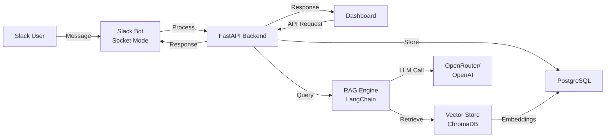

# Wingman

AI-powered Slack support assistant with RAG capabilities. Answers questions using LangChain, OpenRouter/OpenAI, and your indexed documents.

## Features

- Slack integration (mentions, DMs, slash commands)
- RAG-powered responses with LangChain
- Document indexing and semantic search
- ChromaDB vector store
- PostgreSQL persistence
- Next.js dashboard
- Docker Compose ready

## Architecture



## Quick Start

**Prerequisites**: Docker, Docker Compose, Slack workspace admin access, OpenRouter/OpenAI API key

```bash
# Clone and configure
git clone https://github.com/echohello-dev/wingman.git
cd wingman
cp .env.example .env

# Edit .env with your credentials:
# - SLACK_BOT_TOKEN (xoxb-*)
# - SLACK_APP_TOKEN (xapp-*)
# - SLACK_SIGNING_SECRET
# - OPENROUTER_API_KEY or OPENAI_API_KEY
```

**Start services:**
```bash
docker compose up -d
```

- Backend API: http://localhost:8000
- Dashboard: http://localhost:3000
- API Docs: http://localhost:8000/docs

**Test it:**
- Slack: Mention `@Wingman` or DM `/wingman your question`
- Dashboard: Navigate to http://localhost:3000
- API: `curl -X POST http://localhost:8000/api/ask -H "Content-Type: application/json" -d '{"question": "Help!"}'`

## Documentation

- [setup.md](docs/setup.md) - Installation & configuration
- [slack-auth.md](docs/slack-auth.md) - Token types & authentication
- [getting-started.md](docs/getting-started.md) - Quick reference

## Development

**Backend:**
```bash
cd backend
python -m venv venv && source venv/bin/activate
pip install -r requirements.txt
docker compose up -d postgres chroma
uvicorn app.main:app --reload
```

**Frontend:**
```bash
cd frontend
npm install && npm run dev
```

**Or use mise:**
```bash
mise run dev-backend   # Terminal 1
mise run dev-frontend  # Terminal 2
mise run dev-bot       # Terminal 3
```

**Commands:**
```bash
docker compose ps              # Check services
docker compose logs -f         # View logs
docker compose down -v         # Stop & clean
mise run test-backend          # Run tests
```

## Security

- Never commit `.env` files
- Rotate tokens regularly
- Use environment-specific secrets
- Review [slack-auth.md](docs/slack-auth.md) for best practices

## Contributing

Contributions welcome! See [contributing.md](contributing.md) for guidelines.

## License

MIT License

## Built With

[FastAPI](https://fastapi.tiangolo.com/) • [Slack Bolt](https://slack.dev/bolt-python/) • [LangChain](https://www.langchain.com/) • [OpenRouter](https://openrouter.ai/) • [ChromaDB](https://www.trychroma.com/) • [Next.js](https://nextjs.org/)

---

Made with care for better Slack support
